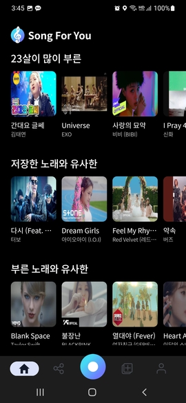
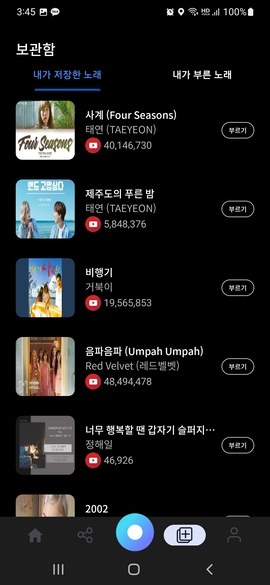
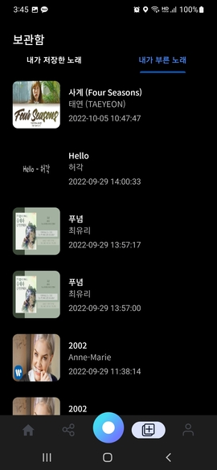
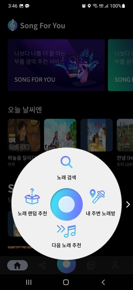
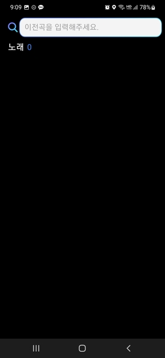
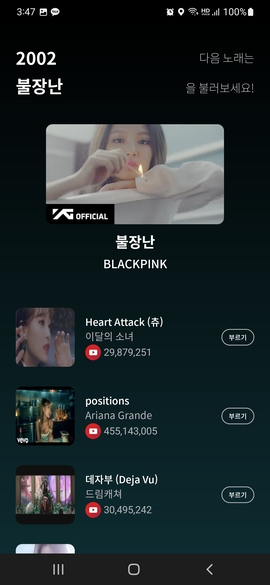
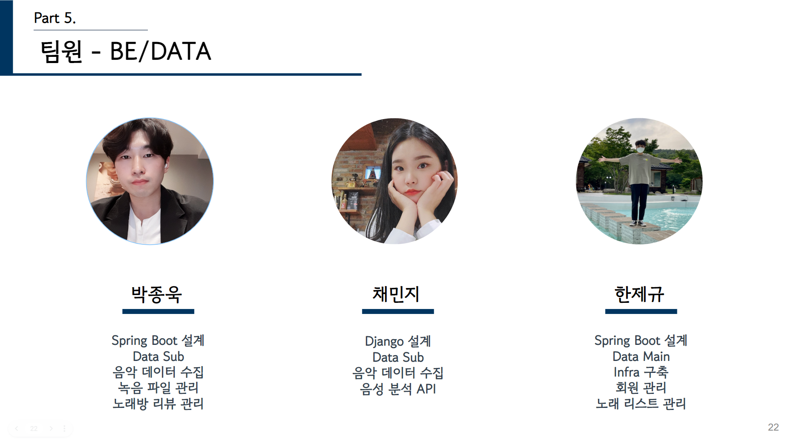

## 🎵 Song For You?

<font size="5" color="orange">**Song For You**</font> 프로젝트는 Android 모바일로 제공되는 부르기 좋은 노래 추천 어플리케이션입니다. 주요 기획 의도는 <strong>개발진의 역량 향상</strong>과 <strong>기존의 듣기 좋은 노래 추천 앱 서비스에서 제공하지 않는 부를 노래 추천앱 개발</strong>이었습니다.
<br/>
평소 노래방에 자주 가는 팀원들이 모여 노래방에서 부를 음악을 찾기 힘들었던 경험을 개선하기 위해 적극적으로 기획하였으며 모두가 프로젝트의 주인의식을 가지고 직접 사용할 수 있는 추천 앱을 제작하였습니다. 기존 서비스에서 제공하지 않는 부르기 좋은 노래를 추천하는데에 초점을 두었습니다.
<br/>

<h5>👟 로그인/ 회원가입 화면</h5>
<hr>


<br/>

<h5>🗺 메인 화면</h5>
<hr>



<br/>

<h5>🗺 보관함 화면 </h5>
<hr>




<br/>

<h5>🗺 다음곡 추천 </h5>
<hr>




<br/>

<h5>🗺 사용자 음성 녹음 / 노래 녹음 </h5>
<hr>


<br/>

<h5>🗺 노래 상세 </h5>
<hr>


<br/>

<h5>🗺 상황별 추천 노래 화면</h5>
<hr>


<br/>

<h5>🗺 노래방 리뷰 화면</h5>
<hr>


<br/>

## 📃 Description

> <h3><font color="green">서비스 전체 기능</font></h3>

<ul>
	<li>보관함 기능 - 노래 보관함에 부를 노래를 보관 가능, 이를 통해 추후 추천에 가중치 반영</li>
	<li>노래 녹음 기능 - 연습을 위해 특정 곡에 대해 녹음을 할 수 있는 기능. 부른 목록과 횟수로 추후 추천 가중치 반영</li>
	<li>음성 녹음 기능 - 자신과 목소리가 비슷한 사용자의 보관/녹음 곡 목록에 대해 추천 기능의 기반기능</li>
	<li>랜덤 추천 기능 - 완전히 랜덤으로 리스트를 추천받는 기능</li>
	<li>보관함 기반 추천 기능 - 자신이 선호했던 노래와 비슷한 노래를 추천받는 기능</li>
	<li>노래 녹음 기반 추천 기능 - 일정 기간동안 자신이 녹음했던 노래의 종류/횟수를 기반으로 하여 추천받는 기능</li>
	<li>음성 녹음 기반 추천 기능 - 자신과 목소리가 유사한 사용자의 보관함 목록을 기반으로 추천받는 기능</li>
	<li>싫어요 기능 - 추천을 받은 곡이 부르기 적합하지 않은 곡이라면 앞으로의 추천 목록에 나오지 않도록 하는 기능</li>
	<li>다음 곡 추천 기능 - 특정 곡과 유사한 곡을 추천받는 기능</li>
	<li>상황별 노래 추천 기능 - 상황별로 적절한 노래를 추천받는 기능</li>
	<li>태그 클라우드 기능 - 노래 리스트의 가사 바탕으로 태그 클라우드를 보는 기능</li>
	<li>노래방 리뷰 기능 - 자신 주변 노래방을 조회하고, 리뷰 작성/조회를 할 수 있는 기능</li>
</ul>
<br/>
<br/>

## 📝 Design

> <h3><font color="green">전체 기술 스택</font></h3>

>  > <br/>

> <h3><font color="green">전체 시스템 구조</font></h3>

>  > <br/>

> <h3><font color="green">ERD 다이어그램</font></h3>

>  > <br/>
> <br/>

> <h3><font color="green">요구사항 명세서</font></h3>

>  <br/>

> <br/>
> <br/>

> <h3><font color="green">API 명세서</font></h3>

>  <br/>

> <br/>
> <br/>

## 📱 Android

> <h3><font color="green">사용한 라이브러리</font></h3>

| Name            | Description                                  |
| --------------- | -------------------------------------------- |
| Navigation      | 프래그먼트 전환 라이브러리                   |
| Glide           | 이미지 로딩 라이브러리                       |
| ViewModel       | 수명주기 고려 데이터를 저장, 관리 라이브러리 |
| Coroutine       | 비동기 처리 라이브러리                       |
| Coroutine Flow  | 비동기 데이터 스트림                         |
| TedPermission   | 안드로이드 권한 라이브러리                   |
| Retrofit        | HTTP 통신 라이브러리                         |
| SimpleRatingBar | RatingBar 커스텀 라이브러리                  |
| Dagger Hilt     | 의존성 주입 라이브러리                       |
| PowerSpinner    | 안드로이드 스피너 라이브러리                 |
| Google Auth     | 구글 소셜 로그인                             |
| Lottie          | 안드로이드 애니메이션 라이브러리             |
| KakaoMap        | 카카오 지도 라이브러리                       |
| AnyChart        | 안드로이드 태그클라우드 통계 라이브러리      |
| TagSphere       | 안드로이드 태그 Sphere 라이브러리            |
| Weather Api     | 공공데이터포털 기상청 날씨 라이브러리        |
| YoutubePlayer   | 유튜브 플레이어 라이브러리                   |
| Exoplayer       | 동영상 플레이어 라이브러리                   |

<br/>

> <h3><font color="green">디렉토리 구조</font></h3>

```markdown
📁AOS
├──📁api
├──📁base
├──📁binding
├──📁datasource
├──📁di
├──📁intro
├──📁model
│ ├──📁dto
│ ├──📁response
├──📁repository
├──📁usecase
│ ├──📁ib_recommend
│ ├──📁kakao
│ ├──📁my_page
│ ├──📁oauth2
│ ├──📁review
│ ├──📁sb_recommend
│ ├──📁song
│ ├──📁song_box
│ ├──📁ub_recommend
│ ├──📁user
│ ├──📁user_state
│ ├──📁weather
├──📁utils
├──📁view
│ ├──📁audio
│ ├──📁audio_play
│ ├──📁circle_view
│ ├──📁detail
│ ├──📁karaoke
│ │ ├──📁review
│ ├──📁login
│ │ ├──📁join
│ │ ├──📁login
│ │ ├──📁social
│ ├──📁main
│ │ ├──📁home
│ │ ├──📁my_page
│ │ ├──📁other
│ │ ├──📁play_list
│ │ ├──📁recommend_list
│ ├──📁next
│ ├──📁random
│ ├──📁search
│ ├──📁user_voice
│ ├──📁video
```

<br/>

> <h3><font color="green">아키텍처 구조</font></h3>

>  > <br/> > <br/>

## 💽 Back-End

> <h3><font color="green">사용한 라이브러리</font></h3>

| 사용라이브러리                              | 사용이유                                                                |
| ------------------------------------------- | ----------------------------------------------------------------------- |
| aop                                         | 서비스 입력 반환 로깅 처리                                              |
| firebase-admin                              | 구글 Oauth 토큰 검증, FCM 서비스 이용                                   |
| jackson-datatype-jsr310                     | LocalDateTime Json 변환,반환 포맷 지정                                  |
| coomons-fileupload ,commons-io              | 파일 업로드                                                             |
| spring-cloud-starter-aws                    | aws S3서비스 사용                                                       |
| jjwt-api,jjwt-impl,jjwt-jackson             | 인증 인가에 사용할 jwt토큰 생성 및 검증                                 |
| spring-boot-starter-data-jpa                | Mysql 에 관리,조작하기 위한 JPA API                                     |
| spring-boot-starter-security                | 인증,인가 특히 권한관리를 쉽게 해주는 스프링 하위 프레임워크            |
| springfox-swagger-ui,springfox-boot-starter | API 명세                                                                |
| mysql-connector-java                        | DBMS                                                                    |
| lombok                                      | 컴파일 타임 코드 자동 생성기                                            |
| querydsl-apt, querydsl-jpa                  | JPA 사용 시에 복잡한 쿼리 처리에 사용                                   |
| spring-boot-starter-validation              | 사용자의 입력에 대한 유효성 검사에 도움을 주는 라이브러리               |
| spring-boot-starter-data-redis              | 휘발성 인메모리 저장소, 중복처리에 사용                                 |
| spring boot batch                           | 포인트 정산, 알림 발송과 같은 scheduled로 지정된 시간의 일괄처리에 사용 |

<br/>

> <h3><font color="green">디렉토리 구조</font></h3>

```markdown
📁backend
├──📁src/main
├──📁java/com/ssafy/gumid207
│ ├──📃Gumid207Application.java
│ ├──📁advice
│ ├──📁config
│ ├──📁customexception
│ ├──📁devutil
│ ├──📁dto
│ ├──📁entity
│ ├──📁jwt
│ ├──📁mypage
│ ├──📁oauth
│ ├──📁recommend
│ ├──📁res
│ ├──📁review
│ ├──📁s3
│ ├──📁song
│ ├──📁songbox
│ ├──📁user
│ ├──📁vote
│ └──📁vote
├──📃.gitignore
└──📃pom.xml
```

<br/>

> <h3><font color="green">패키지 다이어그램</font></h3>

> 

> 도메인 별로 패키지를 구분하려고 하였다. 하지만 req,res,dto의 경우
> 도메인 별로 구분하지 않고 하나의 패키지에 모아서 처리하였다.
> <br/>

> <h3><font color="green">인증 처리과정</font></h3>

> 

> 클라이언트에서 OAuth Provider로 부터 받은 id_token, authorized_code 혹은 AccessToken를
> 서버에 전달하고 서버에서 다시 OAuth Provider로 요청하여 검증을 수행한다.<br/>
> 검증이 정상일 경우 서버에서는 자신의 로직을 통해 서버의 자원에 접근할 수 있는 JWT 토큰을 발급한다.
> <br/> > <br/>

## 👨‍👦‍👦 Team Member

> <h3><font color="red">Android Part</font></h3>


> <br/>

> <h3><font color="red">Back-End Part</font></h3>



> <br/>
> <br/>

## 🏷 License

<p>
This software is licensed under the MIT <a href="https://www.ssafy.com/ksp/jsp/swp/swpMain.jsp" _blank="new">©SSAFY</a>.
</p>
